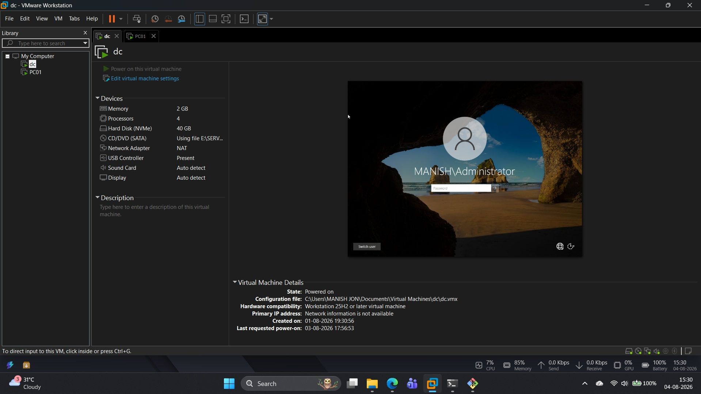
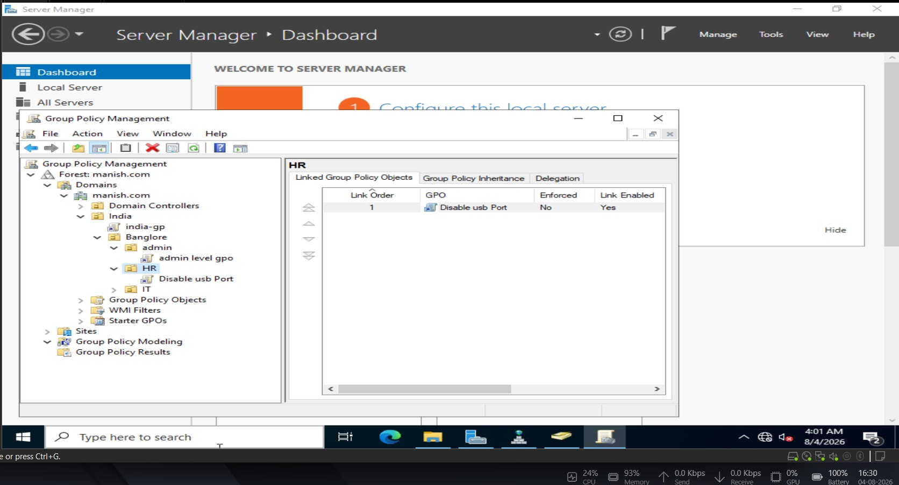
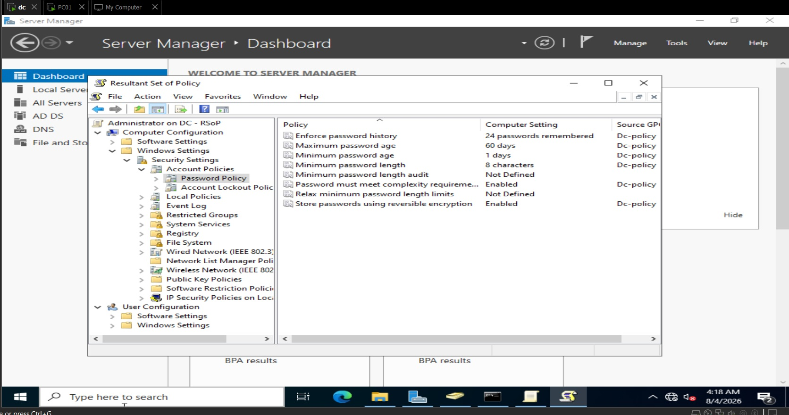
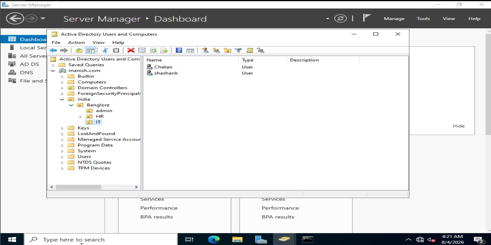
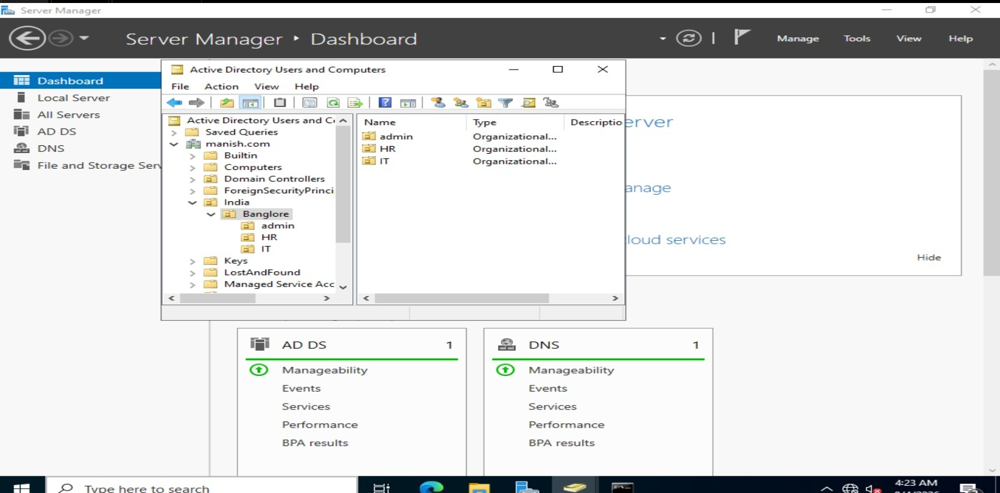

# Active Directory \& Group Policy Implementation Lab

## 🧠 Objective

Simulate a small enterprise network by setting up a Windows Server domain controller, joining client machines, managing users/OUs, and enforcing GPOs.

## 🛠️ Tools Used

* VirtualBox (Oracle)
* Windows Server 2022
* Windows 10 (pc01 VMs)
* Group Policy Management Console (GPMC)
* Active Directory Users \& Computers (ADUC)

## 🔄 Project Phases

### ✅ Phase 1: Environment Setup

* Installed VirtualBox, created 1 DC VM + 1 pc01 VMs.

* Configured networking and static IPs.

### ✅ Phase 2: Domain Controller Configuration

* Promoted Server to DC using AD DS.
* Created `manish` domain.

### ✅ Phase 3–6: Domain Join, User/OU Setup, GPOs

* Joined clients to domain.

* Created OUs (HR, IT, ADMIN), users, and security groups.

* Implemented GPOs: password policy, login restrictions, wallpaper setting, etc.

### ✅ Phase 7: Validation \& Documentation

* Verified GPOs using `gpresult` OR `rsop.msc`.

* Attached screenshots and documented structure.

## 📷 Screenshots

* \[x] Domain Controller Setup

* \[x] OU/User/Group Creation

* \[x] GPO Implemented for client machines
  

## ✅ Outcome

Hands-on experience with:

* Active Directory Management
* GPO Enforcement \& Validation
* Simulated Enterprise Network

## 📂 Documentation

Refer to the `/docs` folder for all screenshots and configuration steps.

\---

👤 Author: Manish Bhatnagar  
📧 Email: manishjon1065@gmail.com  
🔗 LinkedIn: https://www.linkedin.com/in/manish-b-734537168/

